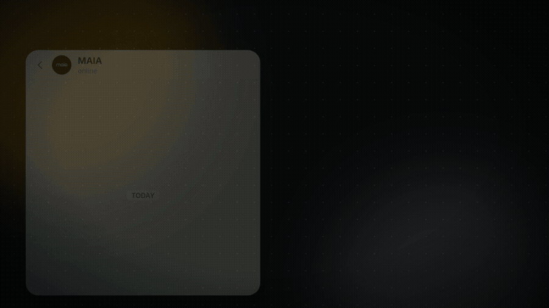

<div align="center">

# MAIA SaaS Launch Video

**A reproducible, code-driven product film for WhatsApp-to-ERP order automation.**

[](https://www.remotion.dev/)
[](https://react.dev/)
[](#rendered-demos)
[](#technical-profile)



</div>

## What This Is

This repository contains the production source for MAIA's SaaS launch film. The story follows a Malaysian food distributor order from messy inbound messages through structured quotation, sales order, delivery order, invoice, approval, and ERP sync.

The visuals are generated with two code-driven pipelines:

| Pipeline | Technology | Purpose |
|---|---|---|
| `motion_a` | React + Remotion | WhatsApp inputs, MAIA understanding, and early story scenes |
| `motion_b` | HTML canvas + Puppeteer + FFmpeg | Quotations, order documents, approval, ERP sync, and recap |
| `work/build` | Python + FFmpeg | Final 101.5-second assembly, captions, audio stems, and delivery renders |

## Rendered Demos

GitHub does not autoplay MP4 files inside a README. Use the animated preview above, or open the original H.264 clips:

- [16:9 recap demo](motion_b/scene_recap_16x9.mp4)
- [9:16 recap demo](motion_b/scene_recap_9x16.mp4)
- [16:9 WhatsApp input scene](motion_a/scene2_inputs_16x9.mp4)
- [9:16 WhatsApp input scene](motion_a/scene2_inputs_9x16.mp4)

## Technical Profile

- Outputs: `1920x1080` and `1080x1920`
- Frame rate: `30 fps`
- Video: H.264, `yuv420p`, web-optimized MP4
- Audio delivery: AAC, 48 kHz
- Master timeline: `101.5 seconds`
- Data continuity: one Malaysian food-distributor order carried across QTN, SO, DN, and invoice

## Repository Map

```text
motion_a/proj/       Remotion project, compositions, fonts, and visual assets
motion_a/*.mp4       Approved scene renders used by the master timeline
motion_b/src/        Browser-rendered document-scene source
motion_b/*.mp4       Approved document and ERP scene renders
script/              English voice-over script
vo_in/               Recorded voice-over input
work/                Timing data, logos, references, and assembly code
docs/                Rendering guide, preview, and AI-agent brief
```

## Quick Start

Requirements: Node.js 20+, npm, FFmpeg, Python 3.11+, and Chrome or Chromium.

```bash
git clone https://github.com/fhmzhroffcl/SaaS-Launch-Video.git
cd SaaS-Launch-Video

cd motion_a/proj
npm ci
npx remotion studio src/indexL.ts
```

The Remotion studio exposes six launch-film compositions: `s2`, `s3a`, and `s3b`, each in 16:9 and 9:16.

### Render Remotion scenes

```bash
cd motion_a/proj
./renderL.sh s2-16x9 s2-9x16 s3a-16x9 s3a-9x16 s3b-16x9 s3b-9x16
```

Outputs are written to `motion_a/out/`.

### Render document and ERP scenes

```bash
cd motion_b
npm install
npm run render:all
```

Set `CHROME_PATH` if Chrome is not installed in a standard macOS, Linux, or Windows location.

For individual clips:

```bash
cd motion_b
npm run render -- recap "" 16x9
npm run render -- review "" 9x16
```

Available scene keys: `s4`, `s5`, `s6`, `s7`, `same`, `review`, `s8`, and `recap`.

## Recreate the Full Film

The complete assembly needs licensed/external intro, outro, music, and SFX assets that are not redistributed here. Point the build scripts to them with environment variables:

```bash
export MAIA_LOGO_DIR=/absolute/path/to/logo-clips
export MAIA_BGM=/absolute/path/to/music.mp3
export MAIA_SFX_DIR=/absolute/path/to/sfx-library

cd work/build
python3 -m pip install -r requirements.txt
python3 build_base.py 16x9
python3 build_base.py 9x16
python3 caps.py
python3 audio.py
sh render.sh
```

Expected logo filenames and detailed assembly notes are in [the rendering guide](docs/RENDERING.md).

## Ask an AI Agent to Render It

Use the ready-to-paste brief in [docs/AI_RENDER_PROMPT.md](docs/AI_RENDER_PROMPT.md). It instructs an agent to inspect dependencies, render representative stills first, verify both aspect ratios, and only then produce full MP4 files.

## Source of Truth

- Order data: [`motion_a/ORDER_DATA.md`](motion_a/ORDER_DATA.md)
- Scene timing: [`work/VO_TIMING.md`](work/VO_TIMING.md)
- Master edit: [`work/build/timeline.py`](work/build/timeline.py)
- Voice-over: [`script/MAIA_launch_VO_EN.md`](script/MAIA_launch_VO_EN.md)
- Document-scene notes: [`motion_b/NOTES.md`](motion_b/NOTES.md)

## Known Boundaries

- Generated intermediates, previous exports, and local caches are intentionally excluded.
- The final assembly requires externally supplied licensed music, SFX, intro, and outro assets.
- Fonts and brand assets remain subject to their respective owners' terms.
- No open-source license is currently granted. Source is shared for review and authorized production use.
